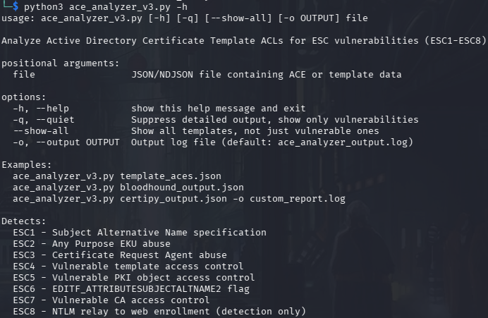

# Overview
ACE Analyzer v3.0 is a comprehensive Python tool that analyzes Active Directory Certificate Services (AD CS) certificate templates and Certificate Authorities to detect ESC1 through ESC8 vulnerabilities. Tho it only partial detects ESC5 and provides a warning for ESC8 when detecting an HTTP web enrollment interface.

# Installation / Requirements
- No installation required
- Download / clone git repository
	- `git clone https://github.com/vianic/ace_analyzer.git`
- Python 3.6 or above

# Usage

- Find all vulnerable templates in domain
	- `python3 ace_analyzer.py <CERT-TEMPLATE-DUMP>.json`
- Show all templates, including secure ones
	- `python3 ace_analyzer.py --show-all <CERT-TEMPLATE-DUMP>.json`
- Quick Scan which only shows detected vulnerabilities
	- `python3 ace_analyzer.py -q <CERT-TEMPLATE-DUMP>.json`

# Quick Summary of dangerous ESC configurations and Remediation
## ESC1 - Subject Alternative Name Specification
- Template allows users to specify any identity in certificate
  
**Requirements for ESC1**:  
- Enrollment rights for low-privileged users
- ENROLLEE_SUPPLIES_SUBJECT flag enabled
- Client Authentication EKU
- Manager Approval disabled
  
**Why it's dangerous**
- User can request certificate as Domain Admin
  
**Attack Chain:** 
- User -> Request cert as DA -> Authenticate -> Full domain compromise

## ESC2 - Any Purpose EKU abuse
- Certificate can be used for any purpose
  
**Requirements for ESC2:**
- Template has "Any Purpose" EKU (OID 2.5.29.37.0) or no EKU
- Manager approval disabled
- Low-privileged users can enroll
  
**Why it's dangerous:**
- Certificate can be used for any purpose, including as an enrollment agent to request certificates on behalf of others.
  
**Attack Chain:**
- User -> Get Any Purpose cert -> Use as enrollment agent -> Request DA cert -> Domain compromise

## ESC3 - Certificate Request Agent abuse 
- Allows requesting certificates on behalf of other users without authorization

**Requirements for ESC3:**
- Template has Certificate Request Agent EKU (OID 1.3.6.1.4.1.311.20.2.1)
- Manager approval disabled
- Low-privileged users cna enroll
  
**Why it's dangerous:**
- Allows requesting certificates on behalf of other users without proper authorization.
  
**Attack Chain:**
- User -> Get enrollment agent cert -> Request cert for DA -> Authenticate as DA -> Domain compromise

## ESC4 - Allowed Template Modification
- Low-privileged users can modify template settings

**Requirements for ESC4:**
- Low-privileged principals have WriteProperty, WriteDacl, WriteOwner, or GenericAll
- On certificate template objects

**Why it's dangerous:**
- Attacker can enable ESC1/ESC2/ESC3 conditions and escalate to Domain Admin

**Attack Chain:**
- Low-privileged user -> Modify template -> Enable ESC1 -> Request admin certificate -> Domain compromise

## ESC5 - PKI Object Access Control
- Manipulation of PKI infrastructure

**Requirements for ESC5:**
- The CA server’s AD computer object (i.e., compromise through S4U2Self or S4U2Proxy)
- The CA server’s RPC/DCOM server
- Any descendant AD object or container in the container ```CN=Public Key Services,CN=Services,CN=Configuration,DC=<COMPANY>,DC=<COM>``` (e.g., the Certificate Templates container, Certification Authorities container, the NTAuthCertificates object, the Enrollment Services Container, etc.)

**Why it's dangerous:**
- Allows manipulation of core PKI infrastructure, potentially adding rogue CAs.

**Attack Chain (Golden Cert):**
- User -> Compromise CA server (RBCD/Shadow Credentials) -> Gain local admin -> Extract CA private key -> Forge certificate for DA -> Authenticate as DA -> Domain control

**Attack Chain (Rogue CA):**
- User with WriteDACL on PKI objects -> Modify NTAuthCertificates -> Add rogue CA -> Issue certificates as any user -> Authenticate as DA -> Domain control

**Attack Chain (Machine Account Takeover):** 
- User with write access to CA computer object -> RBCD/Shadow Credentials attack -> Compromise CA server -> Backup CA private key -> Forge Golden Certificate -> Authenticate as DA -> Domain control

## ESC6 - EDITF_ATTRIBUTESUBJECTALTNAME2 Flag
SAN specification making "secure" templates vulnerable

**Requirements for ESC6:**
- EDITF_ATTRIBUTESUBJECTALTNAME2 flag enabled on Certificate Authority
- At least one template that allows low-privileged user enrollment
- Template allows client authentication (for domain authentication)
- Manager approval disabled

**Why it's dangerous:**
- Even "secure" templates become vulnerable to SAN specification attacks.

**Attack Chain:**
- User -> Request cert from any template -> Add SAN for DA -> Authenticate as DA -> Domain control

## ESC7 - Vulnerable CA Access Control
Modifying CA settings is allowed

**Requirements for ESC7:**
- Low-privileged user has ManageCA or ManageCertificates permissions on CA object
- ManageCA allows: modifying CA settings, enabling EDITF_ATTRIBUTESUBJECTALTNAME2, adding Certificate Officers
- ManageCertificates allows: approving pending certificate requests
- At least one template available for enrollment with client authentication

**Why it's dangerous:**
- Allows modifying CA settings, enabling dangerous flags, or approving pending certificates.

**Attack Chain:**
- User -> Modify CA settings -> Enable ESC6 -> Exploit any template -> Domain control

## ESC 8 - NTLM Relay to Web Enrollment
**Requirements for ESC8:**
- Web enrollment interface enabled (HTTP endpoint)
- HTTP endpoint does NOT enforce HTTPS
- HTTP endpoint does NOT enforce Extended Protection for Authentication (EPA)
- NTLM authentication accepted on web enrollment endpoint
- At least one certificate template allows domain computer/user enrollment and client authentication
- Ability to coerce victim authentication (PetitPotam, PrinterBug, etc.)

**Why it's dangerous:**
- NTLM relay attacks can capture authentication and request certificates as the victim.

**Attack Chain:**
- Attacker -> Relay NTLM -> Request cert as victim -> Authenticate as victim

# Gathering Data
## ADExplorer.exe Snapshot (BloodHound)
- Using ADExplorer.exe it is possible to perfom a snapshot of connected domains
- Take a snapshot via PowerShell or GUI:
	- `ADExplorer.exe -snapshot "" <SNAPSHOT-OUTPUT>.dat`
- Convert to BloodHound format with ``ADExplorerSnapshot.py``
	- `python3 ADExplorerSnapshot.py snapshot.dat -o /<PATH-TO>/<OUTPUT_DIRECTORY>/<OUTPUT>.txt -m BloodHound`
- **Advantages**:
	- Contains template properties (ESC1 detection)
	- Includes all templates in domain
	- Compatible with BloodHound for visualization
	- Best for comprehensive analysis

## ADExplorer.exe Snapshot (NDJSON Format)
- Using ADExplorer.exe it is possible to perfom a snapshot of connected domains
- Take a snapshot via PowerShell or GUI:
	- `ADExplorer.exe -snapshot "" <SNAPSHOT-OUTPUT>.dat`
- Convert to BloodHound format with ``ADExplorerSnapshot.py``
	- `python3 ADExplorerSnapshot.py snapshot.dat -o /<PATH-TO>/<OUTPUT_DIRECTORY>/<OUTPUT>.txt -m Objects`
- **Advantages**:
	- Complete AD object dump
	- Useful for custom processing
	- Can analyze non-template objects too
- **Disadvantages**:
	- Larger file size
	- Requires parsing nTSecurityDescriptor
	- Currently limited ACE extraction

## Certipy/Certify
- Either gather all certificate templates or just enumerate vulnerable templates:
	- `certipy find [-vulnerable] -u <USER> -p <PASSWORD> -dc-ip <DC_IP>`
	- `Certify.exe find [/ca:<FQDN-SERVER>\<CA-NAME>] [/domain:<DOMAIN>.local] [/path:CN=Configuration,DC=<DOMAIN>,DC=local] [/quiet]`
- **Advantages**:
	- Quick online enumeration
	- Includes vulnerability assessment
	- Template properties included
- **Disadvantages**:
	- Requires domain credentials
	- Online tool (may be detected)

## Raw ACE Array
- Manual LDAP query
- PowerShell export
	- `$templates = Get-ADObject -SearchBase "CN=Certificate Templates,..." -Filter {objectClass -eq "pKICertificateTemplate"} -Properties nTSecurityDescriptor`
	```bash
	  $template = Get-ADObject -Filter {cn -eq "TemplateName"} -Properties nTSecurityDescriptor
	$template.nTSecurityDescriptor.Access | ConvertTo-Json > aces.json
	```
- **Advantages**:
	- Simple format
	- Easy to generate manually
	- No tool dependencies
- **Disadvantages**:
	- No template properties
	- Single template only
	- No automatic ESC1 detection

# Format Guide 
- ace_analyzer automatically detects the format of the provided data.
- There is no need to specify the format manually
```
[*] Loading data from: input.json
[*] Detected BloodHound JSON format
[*] Found 15 certificate template(s)

[*] Loading data from: input.json
[*] Found 65 ACE entries
```

## ADExplorer Dump
### BloodHound
```json
{
  "meta": {
    "type": "certtemplates",
    "count": 5,
    "version": 5
  },
  "data": [
    {
      "Properties": {
        "name": "WebServer@CONTOSO.LOCAL",
        "enabled": true,
        "enrolleesuppliessubject": false,
        "clientauthentication": true,
        "requiresmanagerapproval": true,
        "type": "Certificate Template"
      },
      "Aces": [
        {
          "PrincipalSID": "S-1-5-21-...-512",
          "PrincipalType": "Group",
          "RightName": "Enroll"
        }
      ]
    }
  ]
}
```

### NDJSON File
```json
{"objectClass":["top","pKICertificateTemplate"],"cn":["WebServer"],"distinguishedName":["CN=WebServer,CN=Certificate Templates,CN=Public Key Services,CN=Services,CN=Configuration,DC=contoso,DC=local"],"nTSecurityDescriptor":{...}}
{"objectClass":["top","user"],"sAMAccountName":["admin"],...}
```

## certipy/Certify
```json
{
  "Certificate Authorities": {
    "0": {
      "CA Name": "CONTOSO-CA",
      "DNS Name": "dc.contoso.local"
    }
  },
  "Certificate Templates": {
    "0": {
      "Template Name": "WebServer",
      "Display Name": "Web Server",
      "Certificate Authorities": ["CONTOSO-CA"],
      "Enabled": true,
      "Client Authentication": true,
      "Enrollment Rights": [
        "CONTOSO.LOCAL\\Domain Users"
      ],
      "[!] Vulnerabilities": {
        "ESC1": "..."
      }
    }
  }
}
```

## RAW ACE Array
```json
[
  {
    "PrincipalSID": "S-1-5-21-1234567890-1234567890-1234567890-512",
    "PrincipalType": "Group",
    "RightName": "Enroll",
    "IsInherited": false
  },
  {
    "PrincipalSID": "S-1-5-11",
    "PrincipalType": "Group",
    "RightName": "WriteProperty",
    "IsInherited": false
  }
]
```

## Converting between Formats
- BloodHound to Raw ACEs
	- `jq '.data[0].Aces' bloodhound.json > aces.json`
- Certipy → BloodHound
	- `certipy find -u user@domain -p pass -dc-ip 10.0.0.1 -bloodhound`
- PowerShell → Raw ACEs
```powershell
$templates = Get-ADObject -SearchBase "CN=Certificate Templates,..." `
    -Filter {objectClass -eq "pKICertificateTemplate"} `
    -Properties nTSecurityDescriptor

foreach ($template in $templates) {
    $aces = @()
    foreach ($ace in $template.nTSecurityDescriptor.Access) {
        $aces += @{
            PrincipalSID = $ace.IdentityReference.Value
            PrincipalType = "Unknown"
            RightName = $ace.ActiveDirectoryRights
            IsInherited = $ace.IsInherited
        }
    }
    $aces | ConvertTo-Json > "$($template.Name)_aces.json"
}
```

## Format Issues Troubleshooting
- "Could not find valid JSON in file"
	- Check if file is valid JSON: `jq . file.json`
	- Check for BOM or encoding issues: `file file.json`
- "No valid ACE data found"
	- Verify file contains ACE information
	- Check field names match expected format
	- Use `-v` flag if available for verbose output
- "Detected NDJSON but no templates"
	- File may not contain certificate template objects
	- Verify: `grep pKICertificateTemplate objects.ndjson`
- "BloodHound format but no templates"
	- File may be for different object type
	- Ensure using `*_certtemplates.json` not `*_computers.json`

# General Troubleshooting / Frequently Made Mistakes (FMM)
- "No valid ACE data found"
	- File format may not be supported. Check for validity:
		- `jq . template.json`
	- Does it contain ACE data with PrincipalSID and RightName fields?
- "BloodHound format but no templates"
	- The file may be for a different object type (users, computers, etc.)
	- Make sure that the input file is something like `*_certtemplates.json`
- Script runs but shows no output:
	- Template might be properly secured. Use `--show-all` to see all templates:
		- `python3 ace_analyzer.py --show-all template.json`

# Performance Considerations

| Format          | File Size (typical) | Parse Time | Memory Usage |
| --------------- | ------------------- | ---------- | ------------ |
| BloodHound JSON | 10KB - 5MB          | < 1s       | Low          |
| NDJSON          | 100MB - 5GB         | 2-30s      | Medium       |
| Certipy JSON    | 50KB - 10MB         | < 1s       | Low          |
| Raw ACE Array   | 1KB - 100KB         | < 1s       | Very Low     |

For large NDJSON files (>1GB), consider:
- Converting to BloodHound format first
- Extracting only certificate templates
- Using a machine with sufficient RAM

# Example Output
## Multi-Template Analysis (BloodHound Format)
```
python3 ace_analyzer_v3.py --quiet example_bloodhound_format.json

[*] Loading data from: example_bloodhound_format.json
[*] Detected BloodHound JSON format
[*] Found 2 certificate template(s) and 0 CA(s)

======================================================================
ACE Analyzer v3.0 - ESC1-ESC8 Analysis Report
Generated: 2025-12-11 16:49:41
Input File: example_bloodhound_format.json
======================================================================

[*] Found 2 certificate template(s) and 0 CA(s)

======================================================================
Certificate Template: VULNERABLE-TEMPLATE@<DOMAIN>.<LOCAL>
======================================================================
Object ID: S-1-5-21-14503262-1260671939-794563710-5001

Template Configuration:
======================================================================
  Status: ENABLED
  Requires Manager Approval: False
  Enrollee Supplies Subject: True [DANGEROUS]
  Client Authentication: True
  Extended Key Usages:
    - Client Authentication (1.3.6.1.5.5.7.3.2)
    - Email Protection (1.3.6.1.5.5.7.3.4)

SECURITY ASSESSMENT - ESC VULNERABILITY DETECTION
======================================================================
CRITICAL: ESC1 VULNERABILITY DETECTED!
======================================================================
This template allows low-privileged users to specify arbitrary
Subject Alternative Names (SAN) and request certificates for any user.

Vulnerable Principals:
  - Domain Users
  - Authenticated Users

CRITICAL: ESC4 VULNERABILITY DETECTED!
======================================================================
Low-privileged principals can MODIFY this certificate template,
allowing them to reconfigure it for privilege escalation.

Vulnerable Principals:
  Principal: Authenticated Users
  SID: S-1-5-11
  Dangerous Rights:
    [X] WriteProperty
    [X] WriteDacl
  [X] Can also ENROLL (complete attack chain possible)

REMEDIATION RECOMMENDATIONS
======================================================================

ESC1 Remediation:
  1. Disable 'Enrollee Supplies Subject' flag
  2. Enable Manager Approval
  3. Restrict enrollment to specific groups

ESC4 Remediation:
  1. Remove WriteProperty, WriteDacl, WriteOwner from low-privilege groups
  2. Audit recent template modifications (Event ID 4899)

General Best Practices:
  * Use specific security groups for enrollment (not Domain Users)
  * Regularly audit certificate template permissions
  * Monitor Event IDs 4886, 4887, 4899 for suspicious activity
  * Implement least privilege access for all templates


======================================================================
SUMMARY: Analyzed 2 templates and 0 CAs, found 1 template(s) with concerns
======================================================================

[*] Analysis complete. Results written to: ace_analyzer_output.log
```

___
# Resources
- [Certified Pre-Owned - SpecterOps Whitepaper](https://specterops.io/wp-content/uploads/sites/3/2022/06/Certified_Pre-Owned.pdf)
- [Certipy Tool](https://github.com/ly4k/Certipy)
- [ADExplorerSnapshot.py](https://github.com/c3c/ADExplorerSnapshot.py)
- [BloodHound](https://github.com/SpecterOps/BloodHound)
- [Microsoft AD CS Documentation](https://docs.microsoft.com/en-us/windows-server/identity/ad-cs/)
